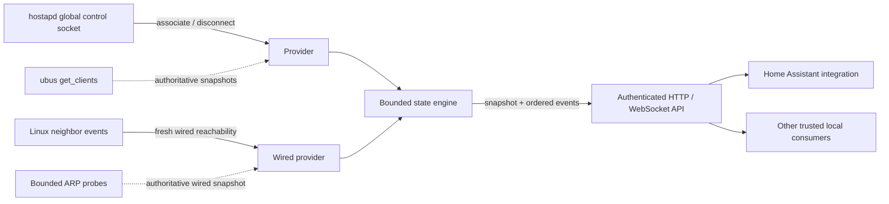

<p align="center">
  
</p>

# OpenWrt Presence Agent

**A fast, read-only client observation service for OpenWrt.**

OpenWrt Presence Agent turns local Wi-Fi association and wired reachability
changes into a normalized, authenticated API that trusted local applications
can consume without receiving router administration access. Wi-Fi uses
push-based hostapd events. Ethernet combines fresh Linux neighbor events with
bounded active ARP reconciliation so stale leases and neighbor entries do not
count as presence.

The official
[OpenWrt Presence integration](https://github.com/theoabw/ha-openwrt-presence)
for Home Assistant is the first reference consumer, not a requirement. Other
consumers can use the same versioned HTTP and WebSocket contract for local
dashboards, automation systems, monitoring, or purpose-built integrations.

> [!IMPORTANT]
> **Hardware test status:** the GL.iNet Flint 3 (`GL-BE9300`) running GL.iNet
> firmware 4.9.0 is currently the only router on which the complete agent and
> Home Assistant path has been live-tested. Packages built successfully for
> other OpenWrt releases and CPU architectures are build-tested, not
> hardware-tested. Flint 2 and every other router/firmware combination remain
> unverified until someone completes and reports the
> [compatibility checklist](docs/compatibility.md).
>
> Trying it on another router? Please
> [share your experience](https://github.com/theoabw/openwrt-presence-agent/issues/new?template=router-compatibility.yml),
> whether it works fully, partly, or not at all. Even a short report is useful.

> [!TIP]
> **Across 110 measured Flint 3 Wi-Fi transitions, every observer event reached
> the reference Home Assistant consumer in under 20 ms:** 6.5 ms median, 15.9 ms
> p99, and 17.2 ms maximum. The larger 100-transition run stayed under 13 ms.
> During that run the observer used about 10.4 MiB RSS and 0.20% process CPU.
> See the [methodology, boundaries, and sanitized results](docs/performance.md).

## Why a dedicated client observation service?

- **Low latency:** hostapd and fresh wired-neighbor events enter the state
  engine without a consumer polling wait.
- **Consumer-neutral:** stable JSON snapshots and ordered WebSocket events are
  independent of any automation platform.
- **Small security boundary:** authenticated read-only snapshots and events;
  no shell, generic ubus, UCI mutation, firewall management, or router control.
- **Correct across radios:** one disassociation removes one BSS connection
  instead of declaring global absence.
- **Self-healing:** periodic and recovery-triggered snapshots repair missed or
  reordered provider input.
- **Resource-bounded:** client maps, command output, messages, queues,
  subscribers, and slow consumers all have explicit limits.
- **OpenWrt-native operation:** UCI configuration, `procd` supervision, stable
  identity, generated bearer credentials, and no automatic WAN firewall rule.

### Compared with common client-tracking approaches

| Approach | Router work | Detection behavior |
|---|---|---|
| **OpenWrt Presence Agent** | Lightweight event subscribers plus corrective Wi-Fi and ARP snapshots | Wi-Fi changes and fresh wired reachability are pushed; wired absence is actively confirmed |
| Ping presence | Repeated ICMP probes | Detection waits for a probe and depends on sleeping clients answering |
| Router polling | Repeated remote table/API reads | Detection waits for the next consumer polling interval |
| General router management integration | Broad monitoring and control surface | Presence is one feature among many rather than the security boundary |

The table compares architectures; this project has not published unverified
latency numbers for other integrations.

The observer deliberately solves a narrow infrastructure problem. It does not
configure the router, decide what an observation means to an application, or
claim that network association proves a person's physical location. Consumer
applications own their automation, retention, identity, and occupancy policy.

### Phone identity and randomized MAC addresses

The agent identifies clients by the MAC address they present to the access
point. It cannot determine that two different private or randomized MAC
addresses belong to the same physical phone. If a phone rotates its address,
forgets the network, or resets its network settings, consumers will see a new
client identity and the previous identity will remain separate.

For the most reliable phone presence tracking, configure the phone to use its
device MAC address **only on the trusted home Wi-Fi network**:

- Android usually exposes this per saved network under **Privacy**,
  **MAC address type**, or a manufacturer-specific equivalent. Select
  **Use device MAC**. See
  [Android Help](https://support.google.com/android/answer/9654714).
- Apple devices expose **Private Wi-Fi Address** in the selected network's
  details. **Off** gives the most predictable identity. Recent versions also
  offer **Fixed**, which may be sufficient until the network is forgotten or
  network settings are reset. See
  [Apple Support](https://support.apple.com/102509).

Do not disable MAC privacy globally. Leave it enabled for public and other
untrusted networks. Using the hardware MAC makes a device easier for that
network and nearby observers to recognize, so this recommendation is limited to
a home network the user trusts and controls.

## Architecture



A Wi-Fi disassociation removes one BSS connection; a client remains present
while connected to another discovered BSS. Provider failure creates uncertainty
instead of synthetic absence.

The wired provider excludes MAC addresses currently associated through
hostapd. Fresh `NUD_REACHABLE` IP-neighbor events can report a wired client
immediately; a two-second active ARP cycle confirms presence and absence when
events are silent or missed.

## Current implementation

- dynamic discovery of all `hostapd.*` ubus objects;
- bounded, fixed-command `/bin/ubus` discovery and snapshots;
- bounded hostapd global-control event input;
- immediate association/disassociation delivery;
- event-assisted wired reachability with bounded concurrent ARP confirmation;
- startup ordering and MAC filtering that keep Wi-Fi clients off the wired path;
- periodic and recovery-triggered authoritative reconciliation;
- bounded client state and slow-consumer disconnection;
- authenticated, read-only REST snapshots and WebSocket events;
- conservative loopback binding by default;
- generated 256-bit bearer credentials and stable agent identity;
- native UCI configuration and `procd` supervision.

The only hardware-verified target is the GL.iNet Flint 3. Compatibility is
based on runtime capabilities rather than vendor name. See
[compatibility](docs/compatibility.md) for the evidence required before a
device is claimed as supported.

## Install on a router

Direct installation of a release package is the primary installation method.
This avoids depending on a router vendor's package registry being current.

1. On the router, inspect its accepted package architectures:

   ```sh
   apk --print-arch                 # OpenWrt 25.12+
   opkg print-architecture          # OpenWrt 24.10 and older
   ```

2. Download the package for your router target and its published SHA-256 value
   from the
   [GitHub Releases page](https://github.com/theoabw/openwrt-presence-agent/releases)
   to your computer. Do not install a package built for a different target.

3. Verify the download using the checksum published with that release, then
   copy the package to the router and install it locally:

   ```sh
   scp openwrt-presence-agent_VERSION-RELEASE_ARCH.apk root@ROUTER:/tmp/
   ssh root@ROUTER
   apk add --allow-untrusted /tmp/openwrt-presence-agent_VERSION-RELEASE_ARCH.apk
   /etc/init.d/openwrt-presence-agent enable
   /etc/init.d/openwrt-presence-agent start
   ```

   OpenWrt 24.10 and older use a matching `.ipk` with `opkg install`.

4. Confirm that the service started:

   ```sh
   /etc/init.d/openwrt-presence-agent status
   logread -e openwrt-presence-agent
   ```

The API listens only on `127.0.0.1:8787` by default and the package does not
open a firewall port. Continue with the
[installation guide](docs/installation.md) for checksum commands, first API
access, LAN exposure, upgrades, rollback, and removal.

## API

Every request requires:

```text
Authorization: Bearer TOKEN
```

The endpoints are:

```text
GET /v1/info
GET /v1/health
GET /v1/clients
GET /v1/clients/{client_id}
GET /v1/providers
GET /v1/diagnostics
GET /v1/events
```

`/v1/events` is a WebSocket upgrade. A connection receives `stream.hello`, a
current internally consistent `state.snapshot`, then ordered events. Check
`/v1/health` before treating the snapshot as provider-authoritative. There is no
replay; after a disconnect, epoch change, or sequence gap, reconnect and accept
the next snapshot.

See the [API guide](docs/api.md) and [machine-readable contracts](api/).
Developers building another adapter should also read the
[consumer integration guide](docs/consumers.md).

## Help test more OpenWrt routers

If your router exposes compatible `hostapd.*` ubus objects and the hostapd
global control socket, please try the package and tell us how it went. Reports
from real installations are especially valuable because they reveal wireless
driver and firmware differences that SDK builds and virtual machines cannot.
Successful tests, partial results, failures, unexpected behavior, and setup
notes are all welcome.

The short
[router compatibility report](https://github.com/theoabw/openwrt-presence-agent/issues/new?template=router-compatibility.yml)
only requires the router/firmware, an overall result, and whatever you had time
to test. Completing the full [compatibility checklist](docs/compatibility.md)
is appreciated but not required to share useful feedback. Never include
wireless credentials, bearer tokens, router dumps, or client identities.

## AI-assisted development

Parts of this repository may be created or revised with the assistance of
generative AI tools. AI-produced suggestions are not treated as authoritative:
maintainers and contributors remain responsible for reviewing, testing,
licensing, security, and the accuracy of every change. The same review and
contribution requirements apply regardless of which tools were used.

## Documentation

- [Installation and lifecycle](docs/installation.md)
- [Configuration and credentials](docs/configuration.md)
- [API and state semantics](docs/api.md)
- [Building another consumer](docs/consumers.md)
- [Performance methodology and results](docs/performance.md)
- [Compatibility and troubleshooting](docs/compatibility.md)
- [Development and package builds](docs/development.md)
- [Security policy](SECURITY.md)
- [Contributing](CONTRIBUTING.md)
